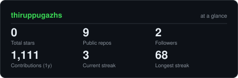
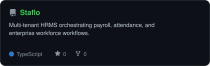
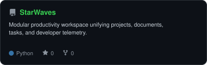
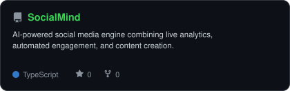
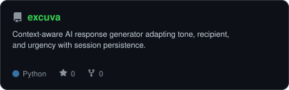

<div align="center">

<!-- PORTRAIT - generated by scripts/dotify.py -->


<br>

<!-- NAME / TAGLINE - animated typing banner -->
<a href="https://github.com/thiruppugazhs">
  
</a>

<br>

<!-- SOCIALS -->
<a href="https://linkedin.com/in/thiruppugazh-srinivasan"></a>
<a href="mailto:thiruppugazhs@gmail.com"></a>
<a href="https://www.thiruppugazhs.in"></a>
<a href="https://github.com/thiruppugazhs"></a>


</div>

---

## `~/` whoami

```console
$ cat about.txt
```

Hi, I'm **Thiruppugazh S**. I am a Computer Science & Engineering undergrad at SRM Easwari Engineering College, Chennai, focused on building end-to-end software products and integrating applied AI into usable, production-ready systems.

- Currently building **[Staflo](https://github.com/thiruppugazhs/Staflo)** (multi-tenant HR platform) & **[StarWaves](https://github.com/thiruppugazhs/StarWaves)** (unified developer workspace)
- Portfolio: **[thiruppugazhs.in](https://www.thiruppugazhs.in)**
- Exploring: **Generative AI workflows, event-driven architectures & time-series modeling**
- Philosophy: **Software should be reliable, well-architected, and built with genuine care for the end user.**

<br>

<div align="center">

## `~/` toolbox


</div>

---

<div align="center">

## `~/` skill radar

<table>
<tr>
<td width="50%" align="center" valign="middle">

<!-- Self-rated radar - edit assets/skills.json, the workflow redraws it -->
<picture>
  <source media="(prefers-color-scheme: dark)"  srcset="assets/radar-dark.svg">
  <source media="(prefers-color-scheme: light)" srcset="assets/radar-light.svg">
  
</picture>

</td>
<td width="50%" align="center" valign="middle">

<!-- Live radar built from real language byte counts across your repos -->
<picture>
  <source media="(prefers-color-scheme: dark)"  srcset="assets/radar-langs-dark.svg">
  <source media="(prefers-color-scheme: light)" srcset="assets/radar-langs-light.svg">
  
</picture>

</td>
</tr>
</table>

</div>

---

<div align="center">

## `~/` contribution calendar

<!-- 3D isometric calendar, regenerated every 6h by .github/workflows/metrics.yml -->


<br><br>

<!-- Snake eats the contribution graph - .github/workflows/snake.yml -->
<picture>
  <source media="(prefers-color-scheme: dark)"  srcset="https://raw.githubusercontent.com/thiruppugazhs/thiruppugazhs/output/snake-dark.svg">
  <source media="(prefers-color-scheme: light)" srcset="https://raw.githubusercontent.com/thiruppugazhs/thiruppugazhs/output/snake.svg">
  
</picture>

</div>

---

<div align="center">

## `~/` the numbers

<!-- Generated by scripts/cards.py into this repo -->
<picture>
  <source media="(prefers-color-scheme: dark)"  srcset="assets/card-stats-dark.svg">
  <source media="(prefers-color-scheme: light)" srcset="assets/card-stats-light.svg">
  
</picture>

<br>


<br><br>


</div>

---

<div align="center">

## `~/` selected work

<!-- Cards generated by scripts/cards.py from assets/projects.json.
     Stars, forks and language are pulled live from the API on every run. -->
<table>
<tr>
<td width="50%">
  <a href="https://github.com/thiruppugazhs/Staflo">
    <picture>
      <source media="(prefers-color-scheme: dark)"  srcset="assets/card-Staflo-dark.svg">
      <source media="(prefers-color-scheme: light)" srcset="assets/card-Staflo-light.svg">
      
    </picture>
  </a>
</td>
<td width="50%">
  <a href="https://github.com/thiruppugazhs/StarWaves">
    <picture>
      <source media="(prefers-color-scheme: dark)"  srcset="assets/card-StarWaves-dark.svg">
      <source media="(prefers-color-scheme: light)" srcset="assets/card-StarWaves-light.svg">
      
    </picture>
  </a>
</td>
</tr>
<tr>
<td width="50%">
  <a href="https://github.com/thiruppugazhs/SocialMind">
    <picture>
      <source media="(prefers-color-scheme: dark)"  srcset="assets/card-SocialMind-dark.svg">
      <source media="(prefers-color-scheme: light)" srcset="assets/card-SocialMind-light.svg">
      
    </picture>
  </a>
</td>
<td width="50%">
  <a href="https://github.com/thiruppugazhs/excuva">
    <picture>
      <source media="(prefers-color-scheme: dark)"  srcset="assets/card-excuva-dark.svg">
      <source media="(prefers-color-scheme: light)" srcset="assets/card-excuva-light.svg">
      
    </picture>
  </a>
</td>
</tr>
</table>

<sub>

| project | domain | stack |
|---|---|---|
| **[Staflo](https://github.com/thiruppugazhs/Staflo)** | Multi-Tenant HR Platform | `React` `TypeScript` `FastAPI` `PostgreSQL` `Docker` |
| **[StarWaves](https://github.com/thiruppugazhs/StarWaves)** | Productivity Workspace | `React` `Vite` `FastAPI` `Firebase` `Firestore` |
| **[SocialMind](https://github.com/thiruppugazhs/SocialMind)** | AI Marketing Engine | `React` `TypeScript` `Express.js` `Gemini AI` |
| **[excuva](https://github.com/thiruppugazhs/excuva)** | Context-Aware AI Generator | `React` `Python` `FastAPI` `Gemini` `OAuth` |

</sub>

</div>

---

<div align="center">

<sub>`01100010 01110101 01101001 01101100 01100100 00100000 01110011 01101111 01101101 01100101 01110100 01101000 01101001 01101110 01100111 00100000 01110111 01101111 01110010 01110100 01101000 00100000 01101100 01101111 01101111 01101011 01101001 01101110 01100111 00100000 01100001 01110100`</sub>

</div>
